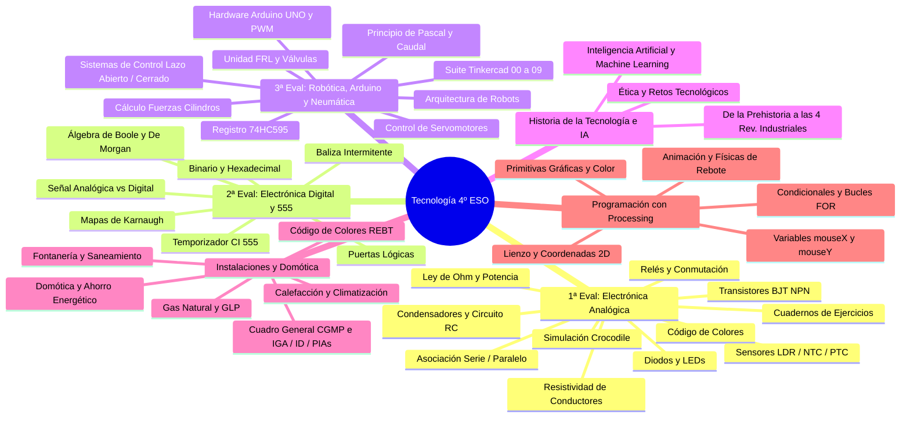

# 📚 Wiki de Conocimiento: Tecnología 4º ESO

Bienvenido a la **Wiki de Conocimiento Atómica** de la materia de **Tecnología de 4º de ESO**. Esta base de conocimiento ha sido compilada a partir de todos los apuntes, presentaciones, prácticas de simulación, ejercicios de taller, proyectos de programación, cuadernos de ejercicios y exámenes oficiales del curso, organizada como un *Digital Garden* con enlaces bidireccionales (`[ [nota] ]`) y notas atómicas modulares.

---

## 🧭 Mapa General de Contenidos (MOC)

---

## ⚡ 1ª Evaluación: Electricidad y Electrónica Analógica

### Conceptos Atómicos
* [[ley_de_ohm_y_potencia]]: Tensión, intensidad, resistencia, potencia disipada y efecto Joule.
* [[resistividad_y_conductores]]: Influencia del material ($\rho$), longitud ($L$) y sección ($S$).
* [[asociacion_resistencias]]: Fórmulas y análisis de agrupaciones serie, paralelo y mixtas.
* [[codigo_colores_resistencias]]: Identificación de 4 bandas, valores nominales y cálculo de tolerancias.
* [[resistencias_variables_ldr_ntc_ptc]]: Potenciómetros, fotorresistencias y termistores en divisores de tensión.
* [[condensadores_y_constante_rc]]: Capacidad ($Q=C\cdot V$), asociaciones y constante de tiempo $\tau = R\cdot C$.
* [[diodos_y_leds]]: Unión P-N, polarización directa/inversa y diodos emisores de luz.
* [[transistor_bjt_corte_activa_saturacion]]: Transistores NPN en corte, zona activa ($I_c = \beta I_b$) y saturación.
* [[rele_electromecanico]]: Control magnético de potencia y diodo volante de protección.
* [[circuitos_conmutacion_y_control_con_reles]]: Conmutación simple, circuito de pasillo e inversión de giro de motores con relés DPDT.

### Cuadernos de Ejercicios y Guías Prácticas
* [[cuaderno_ejercicios_resueltos_electricidad_4eso]]: Colección de ejercicios de Ley de Ohm, Serie y Paralelo con soluciones desarrolladas.
* [[cuaderno_ejercicios_resueltos_condensadores_4eso]]: Ejercicios de condensadores serie/paralelo, conversión de unidades ($F, \mu F, nF, pF$) y circuitos RC.
* [[cuaderno_practicas_simulacion_cocodrile]]: Solucionario íntegro de 26 ejercicios de simulación en Crocodile (conmutación, relés y sensores con transistores).
* [[guia_resolucion_circuitos_electricos]]: Metodología de simplificación y cálculo paso a paso.
* [[guia_calculo_proteccion_led]]: Cálculo y selección de la resistencia comercial (serie E12).
* [[guia_simulacion_crocodile_technology]]: Manual de diseño y simulación en Crocodile Clips.
* [[guia_adaptacion_ambito_practico_y_refuerzo]]: Fichas de refuerzo y apoyo para el ámbito práctico.

### Síntesis de Materiales Originales
* [[fuente_01_evaluacion_electronica_analogica]]: Resumen de apuntes, problemas tipo y prácticas de 1ª evaluación.
* [[fuente_08_cuadernos_ejercicios_electricidad_y_condensadores]]: Fichas de ejercicios de electricidad y condensadores.
* [[fuente_sm_revuela_solucionario_tema4]]: Solucionario íntegro del libro de texto SM Revuela.

---

## 💾 2ª Evaluación: Electrónica Digital y Temporizadores

### Conceptos Atómicos
* [[senal_analogica_vs_digital]]: Naturaleza continua vs niveles lógicos discretos ('0' y '1').
* [[sistemas_numeracion_binario_hexadecimal]]: Conversión de bases, potencias de 2 ($2^n$) y unidades de información (Bit, Byte, KB, MB, GB).
* [[algebra_de_boole_y_de_morgan]]: Postulados fundamentales y teoremas de simplificación de De Morgan.
* [[puertas_logicas_fundamentales]]: NOT, AND, OR, NAND, NOR, XOR, XNOR (funciones y tablas de verdad).
* [[mapas_de_karnaugh]]: Algoritmo matricial de simplificación gráfica en código Gray para 2, 3 y 4 variables.
* [[circuito_integrado_555_monoestable_astable]]: Arquitectura interna DIP-8, modo monoestable y generador astable.

### Guías y Proyectos
* [[guia_diseno_digital_karnaugh_paso_a_paso]]: Caso de estudio completo del túnel contra incendios de 4 variables.
* [[guia_montaje_y_calculo_timer_555]]: Dimensionamiento de $R_1, R_2, C$ para frecuencias y duraciones deseadas.
* [[guia_montaje_baliza_intermitente_555]]: Construcción de baliza de emergencia con dos luces alternantes.

### Síntesis de Materiales Originales
* [[fuente_02_evaluacion_electronica_digital]]: Archivo de presentaciones, ejercicios de aula virtual y prácticas.

---

## 🤖 3ª Evaluación: Robótica, Arduino y Neumática

### Conceptos Atómicos
* [[robotica_y_sistemas_control]]: Definición, clasificación morfológica y sistemas en lazo abierto vs lazo cerrado.
* [[arquitectura_arduino_y_pines]]: Microcontrolador ATmega328P, pines digitales, PWM (~), ADC analógico y alimentación.
* [[modulacion_pwm_arduino_y_servomotores]]: Principio PWM, ciclo de trabajo, control de servomotores ($0-180^\circ$) con `Servo.h` y `map()`.
* [[programacion_arduino_funciones_basicas]]: Estructura `setup()` / `loop()`, I/O digitales, temporizaciones y monitor serie.
* [[registro_desplazamiento_74hc595]]: Expansión SIPO de 8 salidas con 3 pines y función `shiftOut()`.
* [[neumatica_fuerza_presion_pascal]]: Presión ($P=F/S$), unidades (bar, Pa) y principio de la prensa hidráulica.
* [[calculo_fuerza_y_consumo_cilindros_neumaticos]]: Presión absoluta vs relativa, cálculo de fuerza de avance ($F_{av}$) y retroceso ($F_{ret}$) en cilindros de doble efecto.
* [[caudal_y_ecuacion_continuidad]]: Caudal ($Q=S\cdot v$) y variación de velocidad en tuberías ($S_1 v_1 = S_2 v_2$).
* [[circuito_neumatico_frl_compresor]]: Generador, depósito y Unidad de Mantenimiento FRL (Filtro, Regulador, Lubricador).
* [[valvulas_distribuidoras_neumaticas]]: Designación vías/posiciones (3/2, 5/2) y cilindros de simple/doble efecto.
* [[valvulas_logicas_simultaneidad_selectora]]: Funciones lógicas neumáticas "Y" (AND) y "O" (OR).

### Guías de Robótica y Neumática
* [[guia_completa_practicas_arduino_tinkercad]]: Manual integral de las 10 prácticas (00 a 09) de Arduino y Tinkercad.
* [[guia_programacion_arduino_semaforos]]: Código para semáforo simple, cruce doble y semáforo peatonal con pulsador.
* [[guia_uso_sensor_luz_ldr_arduino]]: Montaje de divisor de tensión y calibración de umbrales en el monitor serie.
* [[guia_expansion_pines_74hc595]]: Montaje de 8 LEDs y efectos de barrido (Knight Rider).
* [[guia_resolucion_problemas_pascal_y_continuidad]]: Problemas tipo de prensas hidráulicas y caudales resueltos paso a paso.
* [[guia_simulacion_tinkercad_circuits]]: Prototipado y simulación virtual de circuitos y código Arduino.

### Síntesis de Materiales Originales
* [[fuente_03_evaluacion_robotica_neumatica_control]]: Documentos de robótica, proyectos Arduino y ejercicios neumáticos.
* [[fuente_09_nuevos_materiales_historia_ia_tinkercad_cocodrile]]: Trazabilidad de los materiales de Historia, IA, Tinkercad y Crocodile.

---

## 🏛️ Historia de la Tecnología e Inteligencia Artificial

### Conceptos Atómicos
* [[historia_de_la_tecnologia_y_revoluciones_industriales]]: Evolución tecnológica desde el Paleolítico, civilizaciones antiguas, Edad Media, Imprenta de Gutenberg hasta las 4 Revoluciones Industriales.
* [[inteligencia_artificial_y_tecnologias_emergentes]]: Machine Learning, Deep Learning, Redes Neuronales, IA Generativa, aplicaciones industriales, retos éticos y sostenibilidad.

---

## 🏠 Instalaciones en la Vivienda y Domótica

### Conceptos Atómicos
* [[instalaciones_vivienda_electricidad_cgmp]]: Acometida, Cuadro General (IGA, Diferencial $30\text{ mA}$, PIAs C1 a C5), código de colores REBT y puesta a tierra.
* [[instalaciones_vivienda_agua_gas_calefaccion]]: Red de agua fría y ACS, sifones, bajantes, gas natural vs butano/propano y calefacción/aerotermia.
* [[domotica_y_eficiencia_energetica]]: Arquitectura domótica, sensores ambientales, electroválvulas y ahorro energético.

### Guías y Esquemas
* [[guia_instalaciones_vivienda_cuadro_electrico]]: Grados de electrificación, cálculo de potencia e intensidades y selección de PIAs.
* [[esquemas_instalaciones_y_cgmp]]: Esquemas unifilares del CGMP y distribución de fontanería y saneamiento.

---

## 🎨 Programación Multimedia e Interactiva con Processing

### Conceptos Atómicos
* [[entorno_processing_estructura_y_graficos]]: Lienzo, coordenadas 2D $(X,Y)$, `setup()`, `draw()`, primitivas y colores RGB/Alfa.
* [[interactividad_y_variables_processing]]: Variables del sistema (`width`, `height`, `mouseX`, `mouseY`), eventos de ratón/teclado y bucles `for`.
* [[animacion_y_rebote_processing]]: Cinemática 2D, velocidad, aceleración y algoritmos de rebote elástico en paredes.

### Guías Prácticas
* [[guia_programacion_processing_de_cero_a_interactivo]]: De la diana concéntrica a la pizarra interactiva y minijuego multimedia con marcador.

---

## 🛠️ Taller, Seguridad y Gestión de Aula

* [[guia_montaje_protoboard_y_seguridad]]: Arquitectura interna de la placa de pruebas, reglas de cableado y normas de seguridad.
* [[fuente_05_material_y_gestion_departamento]]: Circulares de familias, cobro de material y proyectos Universal Robots.
* [[fuente_06_taller_y_proyectos_practicos]]: Registro de prácticas entregadas, archivos ZIP y montajes físicos.
* [[fuente_07_nuevos_archivos_processing_e_instalaciones]]: Trazabilidad e inventario de Processing e Instalaciones.

---

## 📝 Exámenes, Solucionarios y Recursos de Consulta Rápida

* [[banco_examenes_y_solucionarios]]: Enunciados oficiales y soluciones detalladas de 1ª, 2ª y 3ª evaluación.
* [[fuente_04_examenes_y_evaluaciones]]: Inventario de exámenes, adaptaciones y rúbricas.
* [[tablas_verdad_puertas]]: Tablas de verdad comparadas de todas las puertas lógicas.
* [[pinout_555_y_arduino]]: Patillaje completo del CI 555 y placa Arduino UNO.
* [[simbologia_neumatica_y_electronica]]: Simbología técnica normalizada (electrónica y neumática ISO 1219).
