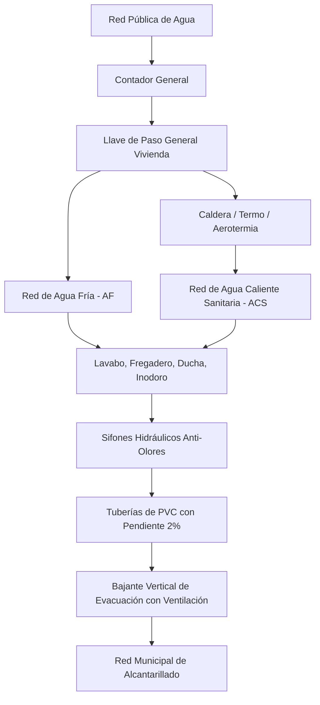

# Esquemas Técnicos de Instalaciones en Viviendas (CGMP y Fontanería)

## 1. Esquema Unifilar del Cuadro General de Mando y Protección (CGMP)

```text
  [ RED DE DISTRIBUCIÓN 230V AC ]
                 |
          [ CONTADOR DIGITAL ]
                 |
      [ DERIVACIÓN INDIVIDUAL (DI) ]
                 |
+----------------+-----------------------------------------------------+
| CUADRO GENERAL DE MANDO Y PROTECCIÓN (CGMP)                          |
|                                                                      |
|  [ IGA: Interruptor General Automático (25A / 32A / 40A) ]           |
|                                |                                     |
|  [ ID: Interruptor Diferencial (30mA / In = 40A) con botón TEST ]    |
|                                |                                     |
|        +-----------+-----------+-----------+-----------+             |
|        |           |           |           |           |             |
|     [ C1 ]      [ C2 ]      [ C3 ]      [ C4 ]      [ C5 ]           |
|      10A         16A         25A         20A         16A             |
|    1.5 mm²     2.5 mm²      6 mm²       4 mm²      2.5 mm²           |
|       |           |           |           |           |              |
+-------+-----------+-----------+-----------+-----------+--------------+
        |           |           |           |           |
    Alumbrado     Tomas      Cocina y    Lavadora     Tomas Baño
    y Luces      General      Horno     Lavavajillas   y Cocina
```

---

## 2. Esquema de Fontanería y Evacuación de Aguas



---
*Conceptos relacionados: [[instalaciones_vivienda_electricidad_cgmp]], [[instalaciones_vivienda_agua_gas_calefaccion]], [[guia_instalaciones_vivienda_cuadro_electrico]].*
