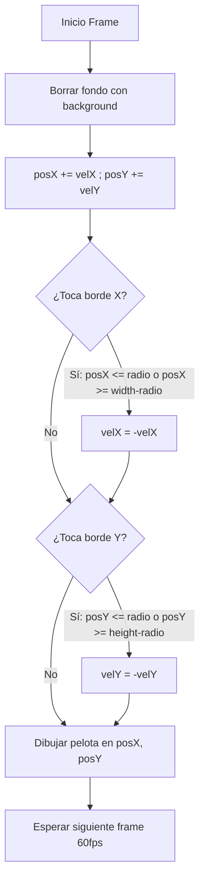

# Fundamentos de Animación y Rebote en Processing

## ¿Cómo se crea una Animación Digital?
Una animación no es más que una rápida sucesión de imágenes fijas ligeramente distintas que engañan al ojo humano gracias al fenómeno de persistencia retiniana.

En Processing:
1. En cada llamada a `draw()` se **borra el fondo** (`background(255)`).
2. Se **actualizan las variables de posición** sumando la velocidad ($x = x + v_x$).
3. Se **dibuja el objeto** en las nuevas coordenadas.

---

## Algoritmo de la Pelota Rebotando (*Bouncing Ball*)

Para que un objeto rebote en los límites de la pantalla:
* Si la coordenada $X$ alcanza el borde derecho ($x \ge \text{width}$) o el borde izquierdo ($x \le 0$), **invertimos el sentido de la velocidad horizontal** ($v_x = -v_x$).
* Si la coordenada $Y$ alcanza el borde inferior ($y \ge \text{height}$) o el borde superior ($y \le 0$), **invertimos el sentido de la velocidad vertical** ($v_y = -v_y$).



---

## Código Completo Documentado:

```java
int posX = 100;
int posY = 100;
int velX = 4;
int velY = 3;
int radio = 20;

void setup() {
  size(600, 400);
}

void draw() {
  background(30, 30, 40); // Fondo oscuro
  
  // 1. Actualizar posiciones
  posX += velX;
  posY += velY;
  
  // 2. Comprobar rebote en eje horizontal X (teniendo en cuenta el radio)
  if (posX >= width - radio || posX <= radio) {
    velX = -velX; // Invierte dirección
  }
  
  // 3. Comprobar rebote en eje vertical Y
  if (posY >= height - radio || posY <= radio) {
    velY = -velY; // Invierte dirección
  }
  
  // 4. Dibujar pelota
  fill(0, 255, 200);
  noStroke();
  ellipse(posX, posY, radio * 2, radio * 2);
}
```

---

## ¿Por qué importa?
Es el modelo fundacional de todos los motores de física de videojuegos 2D (ej. *Pong*, *Breakout*, simuladores cinemáticos).

---

## ¿Cómo se aplica o relaciona?
* Consulta el manual completo de prácticas en [[guia_programacion_processing_de_cero_a_interactivo]].
* Fundamentos previos en [[entorno_processing_estructura_y_graficos]] y [[interactividad_y_variables_processing]].
