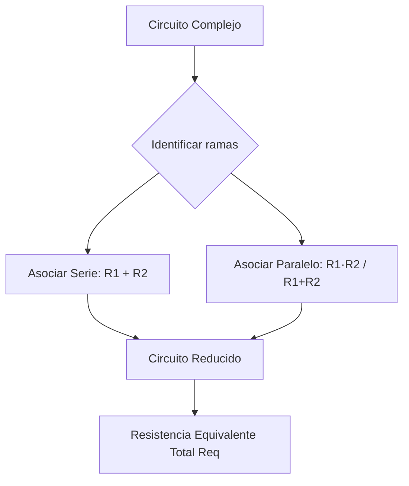

# Asociación de Resistencias

## ¿Qué es?
La **asociación de resistencias** consiste en simplificar un conjunto interconectado de resistores en una única **resistencia equivalente ($R_{eq}$)** que produce el mismo efecto sobre la fuente de alimentación.

### 1. Conexión en Serie
Los componentes están conectados uno tras otro a lo largo de una única rama.
* **Corriente**: Es idéntica en todos los elementos ($I_t = I_1 = I_2 = \dots$).
* **Tensión**: Se reparte proporcionalmente ($V_t = V_1 + V_2 + \dots$).
* **Fórmula**:

$$R_{eq} = R_1 + R_2 + R_3 + \dots + R_n$$

### 2. Conexión en Paralelo
Los terminales de entrada se unen a un mismo nodo común y los de salida a otro nodo común.
* **Tensión**: Es idéntica en todas las ramas ($V_t = V_1 = V_2 = \dots$).
* **Corriente**: Se divide por las ramas ($I_t = I_1 + I_2 + \dots$).
* **Fórmula general**:

$$\frac{1}{R_{eq}} = \frac{1}{R_1} + \frac{1}{R_2} + \dots + \frac{1}{R_n}$$

* **Caso especial (2 resistencias en paralelo)**:

$$R_{eq} = \frac{R_1 \cdot R_2}{R_1 + R_2}$$

* **Caso especial ($N$ resistencias idénticas $R$ en paralelo)**: $R_{eq} = \frac{R}{N}$.

### 3. Circuitos Mixtos
Combinación de agrupaciones en serie y en paralelo dentro de una misma red eléctrica.

---

## ¿Por qué importa?
1. **Reducción y análisis**: Permite resolver circuitos complejos aplicando la [[ley_de_ohm_y_potencia]].
2. **Obtención de valores no estándar**: Si necesitamos un valor óhmico que no existe en las series comerciales de [[codigo_colores_resistencias]], podemos conseguirlo combinando resistencias estándar.
3. **Seguridad en instalaciones**: Toda la instalación eléctrica de viviendas se realiza en paralelo para que el apagado de un receptor no interrumpa el resto y todos reciban $230\text{ V}$.

---

## ¿Cómo se aplica o relaciona?
* Consulta la guía detallada: [[guia_resolucion_circuitos_electricos]].
* Contrasta con la asociación dual en [[condensadores_y_constante_rc]] (donde las fórmulas de serie y paralelo se invierten).

### Esquema Resumen:

