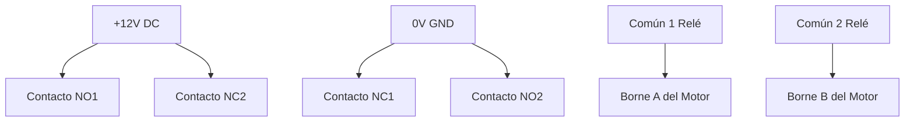

# Circuitos de Conmutación Eléctrica e Inversión de Giro con Relés

## 1. Interruptores y Conmutadores Manuales

* **Interruptor Simple (SPST - Single Pole Single Throw)**: Abre o cierra un único conductor eléctrico (2 bornes).
* **Conmutador Simple (SPDT - Single Pole Double Throw)**: Un borne común (COM) conmuta entre dos salidas (L1 y L2). Permite encender una carga u otra, o diseñar el **circuito de pasillo** con dos conmutadores para encender una misma lámpara desde dos puntos distintos.
* **Interruptor/Conmutador Bipolar (DPDT - Double Pole Double Throw)**: Dos conmutadores SPDT accionados mecánicamente a la vez de forma simultánea.

---

## 2. Inversión del Sentido de Giro de un Motor de Corriente Continua

Para invertir el giro de un motor de CC de imanes permanentes es necesario **invertir la polaridad** de la tensión aplicada a sus dos bornes.

### A. Inversión Manual con Conmutador DPDT (Cruzamiento):
Cruzando las líneas de alimentación en los bornes exteriores del conmutador DPDT:
* *Posición 1*: Borne A del motor a $+12	ext{V}$, Borne B a GND $
ightarrow$ Giro en sentido horario.
* *Posición 2*: Borne A a GND, Borne B a $+12	ext{V}$ $
ightarrow$ Giro en sentido antihorario.

### B. Inversión Automática Mediante Relé DPDT:
Al energizar la bobina del relé mediante un [[transistor_bjt_corte_activa_saturacion]] o un sensor, los contactos internos conmutan la polaridad del motor de forma automática sin intervención manual.

---

## ¿Por qué importa?
Es la base del control de motores en puertas de garaje automáticas, grúas, robots móviles y elevalunas de automóviles.

---

## ¿Cómo se aplica o relaciona?
* Consulta el cuaderno de ejercicios corregidos en [[cuaderno_practicas_simulacion_cocodrile]].
* Conceptos de aislamiento en [[rele_electromecanico]].
