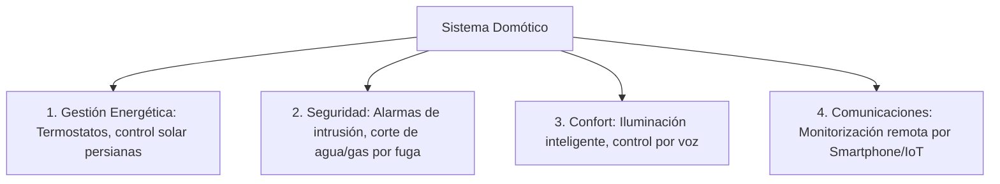

# Domótica, Automatización del Hogar y Eficiencia Energética

## ¿Qué es la Domótica?
La **domótica** es el conjunto de tecnologías y sistemas capaces de automatizar una vivienda, aportando servicios de **gestión energética**, **seguridad**, **confort**, **bienestar** y **comunicaciones**.

### Elementos de un Sistema Domótico:
1. **Sensores**: Captan magnitudes del entorno:
   * Sensores de presencia (PIR), fotorresistencias [[resistencias_variables_ldr_ntc_ptc]] (nivel de luz solar), termostatos (temperatura), detectores de inundación (sondas de agua) y detectores de gas/humo.
2. **Controlador / Centralita**: Unidad de procesamiento ([[arquitectura_arduino_y_pines]] o PLC domótico) que procesa las señales de los sensores y toma decisiones según un algoritmo programado.
3. **Actuadores**: Ejecutan las acciones físicas:
   * Electroválvulas de corte de agua y gas, motores de persianas y toldos, relés de iluminación [[rele_electromecanico]], termostatos inteligentes.

---

## Áreas de Aplicación:

### 1. Ahorro y Eficiencia Energética
* Regulación automática de la climatización según presencia y franja horaria.
* Subida y bajada de persianas motorizadas para aprovechar la radiación solar en invierno o aislar en verano.
* Apagado automático de luces en zonas de paso desocupadas.

### 2. Seguridad Técnica y Patrimonial
* **Detección de fugas de agua**: Una sonda en el suelo del baño detecta humedad y acciona de inmediato una electroválvula que corta la llave de paso general, notificando al móvil del usuario.
* **Detección de escapes de gas**: Cierra el suministro y activa extractores de ventilación.

---

## ¿Por qué importa?
1. **Sostenibilidad y reducción de emisiones**: Optimiza el consumo eléctrico y térmico reduciendo la huella de carbono.
2. **Accesibilidad**: Permite a personas mayores o con movilidad reducida gobernar su hogar mediante asistentes de voz o interfaces adaptadas.

---

## ¿Cómo se aplica o relaciona?
* Programación de autómatas y sensores con [[programacion_arduino_funciones_basicas]] y [[guia_uso_sensor_luz_ldr_arduino]].
* Integración con la red eléctrica en [[instalaciones_vivienda_electricidad_cgmp]].
