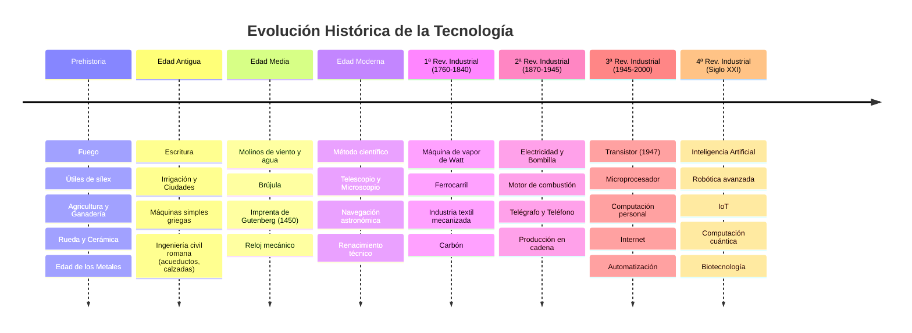

# Historia de la Tecnología y Evolución de las Revoluciones Industriales

## ¿Qué es?
La **Historia de la Tecnología** es el estudio de la evolución de las herramientas, técnicas, máquinas y procesos que la humanidad ha desarrollado para resolver problemas prácticos, satisfacer necesidades y transformar su entorno desde los albores de la prehistoria hasta la era digital contemporánea.

---

## ⏳ Cronología de las Grandes Etapas Tecnológicas

### 1. Prehistoria (Hasta el 3000 a.C.)
* **Paleolítico**: Fabricación de herramientas de piedra tallada (sílex, bifaces), control del fuego y técnicas de caza.
* **Neolítico**: Revolución agrícola y ganadera, domesticación de animales, invención de la rueda, alfarería y tejidos.
* **Edad de los Metales**: Metalurgia del cobre, bronce y hierro; fabricación de aperos de labranza y armas.

### 2. Edad Antigua (3000 a.C. - 476 d.C.)
* **Grandes Civilizaciones Fluviales (Mesopotamia, Egipto)**: Invención de la escritura, sistemas de regadío, albañilería monumental.
* **Grecia Clásica**: Desarrollo de la ciencia teórica, palancas, poleas y el tornillo de Arquímedes.
* **Imperio Romano**: Gran desarrollo de la ingeniería civil y militar: acueductos, calzadas, arcos de medio punto, cúpulas y hormigón puzolánico.

### 3. Edad Media (476 - 1492)
* Difusión de los molinos hidráulicos y de viento para moler grano y accionar batanes.
* Introducción de la brújula magnética, el timón de codaste, la pólvora y el papel traídos de Oriente.
* **Invención de la imprenta de tipos móviles metálicos por Johannes Gutenberg (1450)**: Primera democratización y difusión masiva del conocimiento científico y técnico.

### 4. Edad Moderna y Renacimiento (1492 - 1789)
* Diseños e inventos visionarios del Renacimiento (Leonardo da Vinci).
* Invención del telescopio (Galileo), el microscopio y el nacimiento del método científico experimental.

### 5. Las 4 Revoluciones Industriales:

| Revolución | Periodo | Fuente de Energía Principal | Invención Clave | Impacto Socioeconómico |
| :---: | :---: | :---: | :---: | :--- |
| **1ª Revolución** | $1760 - 1840$ | Carbón mineral y Vapor | **Máquina de vapor (James Watt)** | Nacimiento de la fábrica moderna, éxodo rural a las ciudades, ferrocarril y barcos de vapor. |
| **2ª Revolución** | $1870 - 1945$ | Electricidad y Petróleo | **Motor de combustión interna, dínamo, bombilla** | Producción en serie (Fordismo), automóvil, aviación, telégrafo, teléfono y electrificación de ciudades. |
| **3ª Revolución** | $1945 - 2000$ | Energía Nuclear y Renovables | **Transistor (1947), Microprocesador e Internet** | Era de la información, ordenadores personales, automatización industrial y telecomunicaciones globales. |
| **4ª Revolución** | Siglo XXI | Renovables y Eficiencia | **IA, Robótica colaborativa, IoT, Big Data** | Fábricas inteligentes (*Smart Factories*), computación en la nube, hiperconectividad y biotecnología. |

---

## ¿Por qué importa?
Permite comprender que la tecnología no es un fenómeno aislado, sino el motor de transformación social, económico y cultural de la humanidad.

---

## ¿Cómo se aplica o relaciona?
* Conexión con las tecnologías actuales en [[inteligencia_artificial_y_tecnologias_emergentes]].
* Base de la electrónica moderna originada en 1947: [[transistor_bjt_corte_activa_saturacion]].
