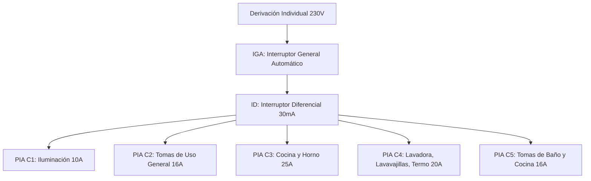

# Instalaciones Eléctricas en Viviendas y Cuadro General (CGMP)

## ¿Qué es?
La **instalación eléctrica de una vivienda** es el conjunto de circuitos y elementos encargados de distribuir de forma segura la energía eléctrica desde la red pública de distribución (acometida) hasta todos los puntos de consumo del hogar (enchufes, luces, electrodomésticos).

### Estructura de la Instalación de Enlace:
1. **Acometida**: Conexión de la red de la compañía distribuidora con el edificio.
2. **Caja General de Protección (CGP)**: Contiene los fusibles generales del edificio.
3. **Línea General de Alimentación (LGA)**: Une la CGP con la centralización de contadores.
4. **Contadores**: Miden la energía consumida en kilovatios-hora ($\text{kWh}$).
5. **Derivación Individual (DI)**: Conduce la electricidad desde el contador hasta el cuadro particular de cada vivienda.

---

## Cuadro General de Mando y Protección (CGMP)

Situado junto a la entrada de la vivienda, alberga los dispositivos de seguridad y control:

### 1. IGA (Interruptor General Automático)
* Protege la instalación interior contra **sobrecargas** y **cortocircuitos** globales. Corta la corriente si la potencia total demandada supera la capacidad máxima de los cables de la vivienda (ej. $25\text{ A}, 32\text{ A}$ o $40\text{ A}$).

### 2. ID (Interruptor Diferencial)
* **Protección de las personas contra contactos directos e indirectos** (electrocución).
* **Principio de funcionamiento**: Mide continuamente la diferencia entre la corriente que entra por la **fase** y la que sale por el **neutro**. Si detecta una fuga a tierra superior a su sensibilidad (**$30\text{ mA}$** en viviendas), salta en milisegundos cortando el suministro.
* Dispone de un botón de prueba (**Test "T"**) que debe pulsarse mensualmente para comprobar su funcionamiento mecánico.

### 3. PIAs (Pequeños Interruptores Automáticos)
Protegen individualmente cada circuito interior contra sobrecargas y cortocircuitos:

| Circuito | Denominación y Uso | Calibre PIA | Sección Mínima Cable |
| :---: | :--- | :---: | :---: |
| **C1** | Iluminación y puntos de luz | **$10\text{ A}$** | $1{,}5\text{ mm}^2$ |
| **C2** | Tomas de corriente de uso general y frigorífico | **$16\text{ A}$** | $2{,}5\text{ mm}^2$ |
| **C3** | Cocina eléctrica (vitrocerámica) y horno | **$25\text{ A}$** | $6\text{ mm}^2$ |
| **C4** | Lavadora, lavavajillas y termo eléctrico | **$20\text{ A}$** | $4\text{ mm}^2$ |
| **C5** | Tomas de corriente de cuartos de baño y cocina | **$16\text{ A}$** | $2{,}5\text{ mm}^2$ |

---

## Código de Colores Normalizado de Conductores (REBT):
* **Fase ($L$)**: Conductor activo que transporta el voltaje ($230\text{ V}$). Colores: **Marrón**, **Negro** o **Gris**.
* **Neutro ($N$)**: Conductor de retorno ($0\text{ V}$). Color: **Azul**.
* **Tierra ($PE$)**: Conductor de protección conectado a una pica metálica enterrada en los cimientos. Color: **Verde y Amarillo**.

---

## ¿Por qué importa?
1. **Seguridad vital**: Evita incendios por sobrecalentamiento de cables y electrocuciones humanas gracias a la combinación de puesta a tierra y diferencial de $30\text{ mA}$.
2. **Normativa técnica**: Cumplimiento del Reglamento Electrotécnico para Baja Tensión (REBT).

---

## ¿Cómo se aplica o relaciona?
* Consulta la guía práctica de dimensionamiento en [[guia_instalaciones_vivienda_cuadro_electrico]].
* Esquema visual en [[esquemas_instalaciones_y_cgmp]].
* Relacionado con los cálculos de [[ley_de_ohm_y_potencia]] y [[resistividad_y_conductores]].
