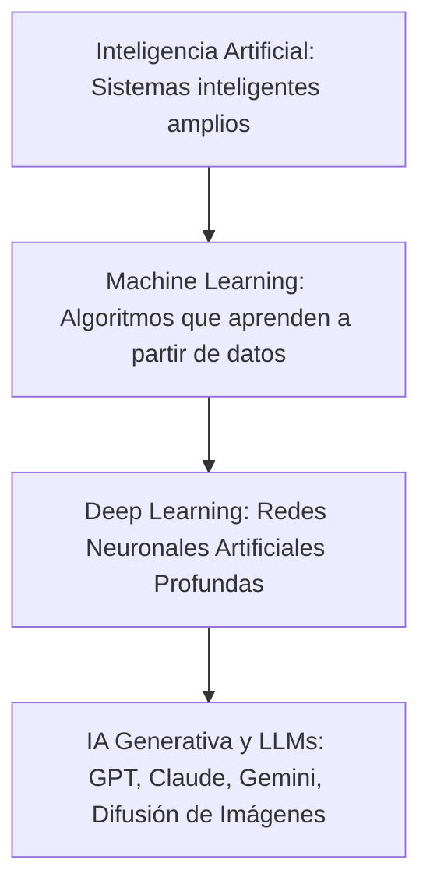

# Inteligencia Artificial (IA) y Tecnologías Emergentes

## ¿Qué es la Inteligencia Artificial?
La **Inteligencia Artificial (IA)** es la disciplina científica y tecnológica englobada dentro de la informática que desarrolla algoritmos y sistemas capaces de realizar tareas que tradicionalmente requerían de la inteligencia humana, tales como el **aprendizaje**, el **razonamiento**, la **resolución de problemas**, el **procesamiento del lenguaje natural (PLN)** y la **percepción sensorial** (visión artificial).

---

## Arquitectura y Niveles de la IA

### 1. Machine Learning (Aprendizaje Automático)
En lugar de programar reglas fijas línea a línea, el sistema aprende patrones analizando grandes volúmenes de datos:
* **Aprendizaje Supervisado**: El algoritmo se entrena con datos etiquetados (ej. miles de fotos etiquetadas como "perro" o "gato") para predecir etiquetas en datos nuevos.
* **Aprendizaje No Supervisado**: El algoritmo encuentra patrones y agrupaciones (*clustering*) en datos no etiquetados.
* **Aprendizaje por Refuerzo**: El agente aprende por ensayo y error recibiendo recompensas o penalizaciones (ej. coches autónomos o IA que aprende a jugar al ajedrez).

### 2. Deep Learning y Redes Neuronales Artificiales
Inspiradas en la estructura biológica de las neuronas del cerebro humano, procesan información en capas sucesivas conectadas por pesos sinápticos ajustables.

---

## Áreas de Aplicación en la Industria y la Sociedad:
1. **Robótica y Automatización**: Brazos robóticos inteligentes capaces de adaptarse a piezas deformables y robots móviles autónomos (AGV/AMR).
2. **Visión Artificial**: Control de calidad industrial por cámara en microsegundos y conducción autónoma.
3. **Medicina**: Detección precoz de patologías en radiografías y diseño de nuevos fármacos moleculares.
4. **Asistentes Inteligentes y Modelos de Lenguaje**: Procesamiento contextual de voz y texto.

---

## Retos Éticos y Sostenibilidad
* **Sesgos Algorítmicos**: Riesgo de perpetuar discriminaciones si los datos de entrenamiento contienen prejuicios históricos.
* **Privacidad y Protección de Datos**: Necesidad de garantizar el anonimato y la seguridad de los usuarios.
* **Consumo Energético y Huella de Carbono**: Los centros de procesamiento de datos de IA demandan ingentes cantidades de electricidad y agua de refrigeración.
* **Impacto Laboral**: Transformación del mercado laboral que exige la adquisición de competencias digitales avanzadas.

---

## ¿Cómo se aplica o relaciona?
* Se integra con el control de robots en [[robotica_y_sistemas_control]].
* Vinculado con la programación en [[entorno_processing_estructura_y_graficos]] y la domótica en [[domotica_y_eficiencia_energetica]].
