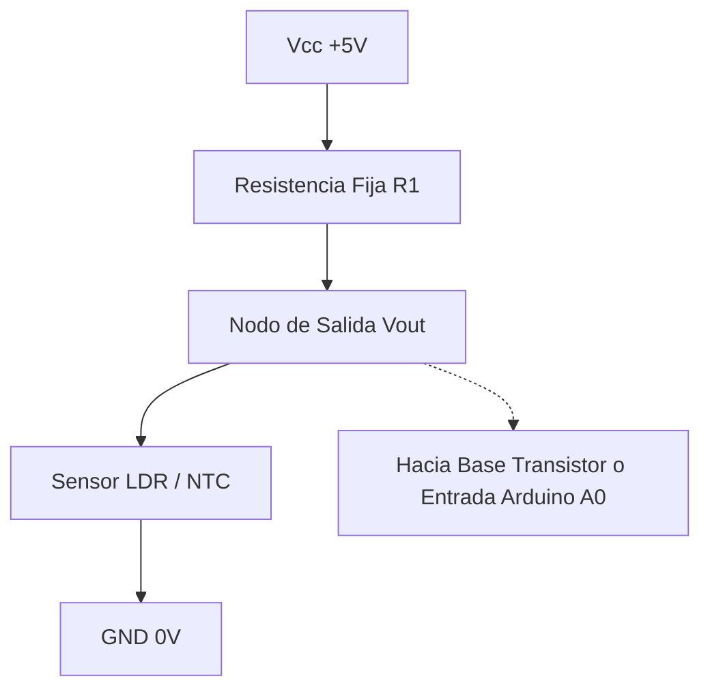

# Resistencias Variables, Sensores LDR, NTC y PTC

## ¿Qué es?
Son componentes cuya resistencia óhmica no es fija, sino que varía en función de un accionamiento mecánico o de un parámetro físico del entorno (luz, temperatura):

### 1. Resistencias Ajustables y Potenciómetros
* **Potenciómetro**: Resistencia de tres terminales con un contacto deslizante (cursor). Permite regular la tensión de salida actuando como divisor de tensión variable.
* **Reóstato**: Resistencia variable de dos terminales para regular la corriente.

### 2. Fotorresistencia (LDR - Light Dependent Resistor)
* Fabricada con sulfuro de cadmio (CdS), material semiconductor sensible a fotones.
* **Comportamiento**: A **mayor nivel de luz**, los fotones liberan electrones y la resistencia **disminuye** drásticamente (desde varios Megaohmios en oscuridad total hasta unos cientos de Ohmios a plena luz solar).

### 3. Termistores (Sensores de Temperatura)
* **NTC (Negative Temperature Coefficient)**: Coeficiente de temperatura negativo. Al **aumentar la temperatura**, su resistencia **disminuye**.
* **PTC (Positive Temperature Coefficient)**: Coeficiente de temperatura positivo. Al **aumentar la temperatura**, su resistencia **aumenta**.

---

## ¿Por qué importa?
1. **Interfaz sensor-circuito**: Constituyen los transductores elementales que convierten magnitudes físicas del mundo real (luz, calor) en señales eléctricas manejables.
2. **Divisores de tensión**: Al colocarse en serie con una resistencia fija, generan un voltaje variable proporcional al estímulo ambiental.
3. **Control automático**: Permiten activar alumbrado público nocturno automático, termostatos de calefacción, alarmas de temperatura y sistemas de protección contra incendios.

---

## ¿Cómo se aplica o relaciona?
* Se integran en circuitos de conmutación con [[transistor_bjt_corte_activa_saturacion]] o microcontroladores [[arquitectura_arduino_y_pines]].
* Consulta las guías prácticas: [[guia_uso_sensor_luz_ldr_arduino]] y [[guia_resolucion_circuitos_electricos]].

### Divisor de Tensión con LDR / NTC:
$$V_{\text{out}} = V_{cc} \cdot \frac{R_{\text{inferior}}}{R_{\text{superior}} + R_{\text{inferior}}}$$

