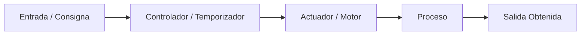
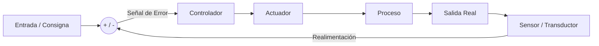

# Robótica y Sistemas de Control

## ¿Qué es un Robot?
Un **robot** es un sistema electromecánico reprogramable y multifuncional diseñado para mover materiales, piezas, herramientas o dispositivos especiales mediante movimientos programados variables para ejecutar tareas diversas.

### Clasificación de los Robots según su Arquitectura Morfológica:
1. **Poliarticulados**: Brazos robóticos industriales fijos con articulaciones rotativas o prismáticas (usados en soldadura, ensamblaje automovilístico, empaquetado).
2. **Móviles**: Robots con ruedas, orugas o patas dotados de gran capacidad de desplazamiento en su entorno (robots aspiradores, robots exploradores marcianos como Curiosity).
3. **Androides**: Robots que imitan la morfología y locomoción del cuerpo humano (bípedos).
4. **Zoomórficos**: Robots que imitan la estructura y movimiento de animales (cuadrúpedos, peces robóticos, hexápodos).
5. **Híbridos**: Combinación de las categorías anteriores (ej. un brazo robótico montado sobre una plataforma móvil sobre ruedas).

---

## Sistemas de Control

Un **sistema de control** es un conjunto de dispositivos que gestionan, comandan, dirigen o regulan el comportamiento de otro sistema o proceso para conseguir un resultado deseado.

### 1. Sistema de Control en Lazo Abierto (Open Loop)
* La señal de salida **NO** se mide ni se compara con la entrada de referencia; **no existe realimentación (feedback)**.
* La acción de control depende exclusivamente de una programación previa o un temporizador. Si ocurre una perturbación externa, el sistema no la corrige.
* *Ejemplos*: Una tostadora de pan (funciona por tiempo, no sabe si el pan se quema), un semáforo con tiempos fijos, una lavadora automática.

### 2. Sistema de Control en Lazo Cerrado (Closed Loop)
* La señal de salida **SÍ** se mide continuamente mediante sensores y se compara con la consigna de entrada mediante un **comparador o detector de error**.
* La señal de error resultante ($e = \text{Consigna} - \text{Salida Medida}$) se envía al controlador para corregir la desviación en tiempo real frente a perturbaciones.
* *Ejemplos*: Un termostato de calefacción (mide la temperatura y apaga/enciende la caldera según la consigna), el control de crucero de un automóvil, un robot seguidor de línea.

---

## ¿Por qué importa?
Es la base conceptual de toda la automatización industrial moderna, la conducción autónoma y los sistemas mecatrónicos inteligentes.

---

## ¿Cómo se aplica o relaciona?
* Los sensores físicos se estudian en [[resistencias_variables_ldr_ntc_ptc]].
* El cerebro programable se implementa con [[arquitectura_arduino_y_pines]] y [[programacion_arduino_funciones_basicas]].
* Los actuadores pueden ser eléctricos o neumáticos: [[valvulas_distribuidoras_neumaticas]].
