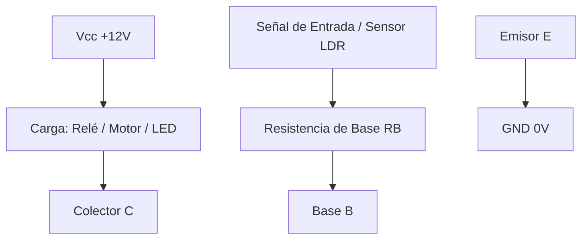

# Transistor Bipolar BJT (Corte, Activa y Saturación)

## ¿Qué es?
El **transistor bipolar de unión (BJT)** es un dispositivo semiconductor de tres capas y tres terminales: **Base (B)**, **Colector (C)** y **Emisor (E)**. Existen dos tipos principales: **NPN** (la flecha del emisor apunta hacia afuera) y **PNP** (la flecha apunta hacia la base).

El transistor es un **amplificador de corriente** controlado por la base: una pequeña corriente que entra por la base ($I_B$) controla una corriente mucho mayor que circula entre colector y emisor ($I_C$).

$$I_E = I_B + I_C \approx I_C$$

### Los 3 Estados de Funcionamiento (Transistor NPN):

| Estado | Condición Eléctrica | Comportamiento | Aplicación |
| :--- | :--- | :--- | :--- |
| **1. Corte** | $I_B = 0$ ($V_{BE} < 0{,}7\text{ V}$) | $I_C = 0$ ; $V_{CE} = V_{cc}$ (Interruptor abierto) | Circuitos lógicos ('0'), apagado de motores/relés |
| **2. Zona Activa** | $I_B > 0$ ; $V_{BE} \approx 0{,}7\text{ V}$ | $I_C = \beta \cdot I_B$ (Amplificador lineal) | Amplificadores de audio, modulación de señal |
| **3. Saturación** | $I_B \ge I_{B,\text{sat}}$ | $I_C = I_{C,\max} = \frac{V_{cc}}{R_C}$ ; $V_{CE} \approx 0{,}2\text{ V}$ (Interruptor cerrado) | Circuitos lógicos ('1'), encendido de cargas de potencia |

Donde **$\beta$ (o $h_{FE}$)** es la **ganancia de corriente** del transistor (típicamente entre $50$ y $300$).

---

## ¿Por qué importa?
1. **La invención más trascendental del siglo XX**: Es la base física de todos los microprocesadores modernos (que contienen miles de millones de transistores microscópicos).
2. **Interruptor electrónico sin piezas móviles**: Permite conmutar corrientes elevadas a altísima velocidad sin desgaste mecánico.
3. **Pilar de la electrónica digital**: Las puertas lógicas de [[puertas_logicas_fundamentales]] están construidas internamente con transistores en corte y saturación.

---

## ¿Cómo se aplica o relaciona?
* Control de sensores LDR/NTC mediante transistores en [[resistencias_variables_ldr_ntc_ptc]].
* Activación de bobinas de alta corriente en [[rele_electromecanico]].
* Resuelto en exámenes: [[banco_examenes_y_solucionarios]].

### Esquema de Conexión como Conmutador:

