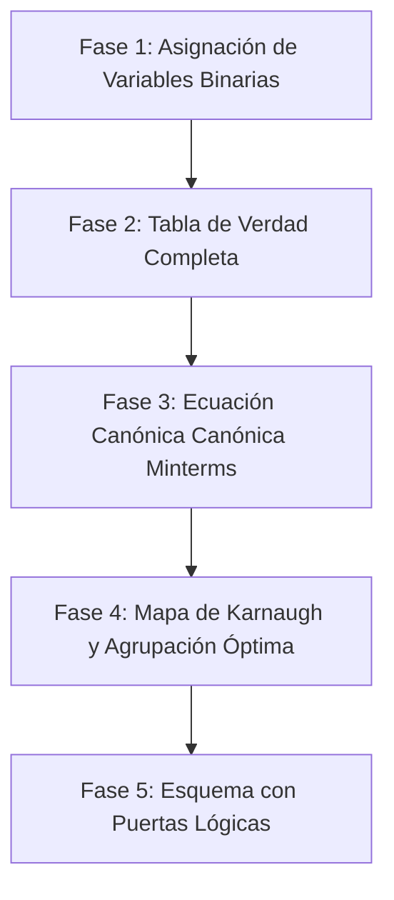

# Guía de Diseño de Circuitos Digitales Combinacionales con Mapas de Karnaugh

Esta guía describe el protocolo de ingeniería estándar para transformar cualquier especificación funcional en un esquema de puertas lógicas optimizado.

---

## Protocolo de Diseño en 5 Fases



---

## Caso de Estudio Práctico: Sistema Contra Incendios de un Túnel

### 1. Enunciado del Problema
Un túnel de autopista dispone de cuatro elementos de detección y alarma:
* Detector térmico ($A$)
* Detector de humos ($B$)
* Detector iónico ($C$)
* Pulsador manual en cabina de control ($D$)

El sistema contra incendios ($S$) debe activarse ($S=1$) en los siguientes casos:
1. Cuando se activan **al menos dos** de los detectores automáticos ($A, B, C$), cualquiera que sea su combinación.
2. Cuando se activa el **pulsador manual de emergencia ($D$)**, con independencia del estado de los detectores automáticos.

---

### 2. Tabla de Verdad (16 combinaciones para 4 variables)

| Fila | $A$ | $B$ | $C$ | $D$ | Salida $S$ | Justificación |
| :---: | :---: | :---: | :---: | :---: | :---: | :--- |
| 0 | 0 | 0 | 0 | 0 | **0** | Ningún detector ni pulsador activo |
| 1 | 0 | 0 | 0 | 1 | **1** | Pulsador $D$ activo |
| 2 | 0 | 0 | 1 | 0 | **0** | Solo 1 detector ($C$) |
| 3 | 0 | 0 | 1 | 1 | **1** | Pulsador $D$ activo |
| 4 | 0 | 1 | 0 | 0 | **0** | Solo 1 detector ($B$) |
| 5 | 0 | 1 | 0 | 1 | **1** | Pulsador $D$ activo |
| 6 | 0 | 1 | 1 | 0 | **1** | 2 detectores activos ($B$ y $C$) |
| 7 | 0 | 1 | 1 | 1 | **1** | 2 detectores y pulsador $D$ |
| 8 | 1 | 0 | 0 | 0 | **0** | Solo 1 detector ($A$) |
| 9 | 1 | 0 | 0 | 1 | **1** | Pulsador $D$ activo |
| 10 | 1 | 0 | 1 | 0 | **1** | 2 detectores activos ($A$ y $C$) |
| 11 | 1 | 0 | 1 | 1 | **1** | 2 detectores y pulsador $D$ |
| 12 | 1 | 1 | 0 | 0 | **1** | 2 detectores activos ($A$ y $B$) |
| 13 | 1 | 1 | 0 | 1 | **1** | 2 detectores y pulsador $D$ |
| 14 | 1 | 1 | 1 | 0 | **1** | 3 detectores activos ($A, B, C$) |
| 15 | 1 | 1 | 1 | 1 | **1** | Todo activo |

---

### 3. Mapa de Karnaugh ($4 \times 4$)

Colocamos $AB$ en las filas y $CD$ en las columnas con ordenación en **Código Gray** ($00, 01, 11, 10$):

```text
  AB \ CD |  00   01   11   10
 ---------+--------------------
    00    |   0    1    1    0
    01    |   0    1    1    1
    11    |   1    1    1    1
    10    |   0    1    1    1
```

### 4. Formación de Grupos de '1's
1. **Grupo 1 (Columna $CD=01$ y $CD=11$ completas)**:
   * Bloque de $8$ unos que cubre toda la mitad derecha donde $D=1$.
   * Término resultante: **$D$**.
2. **Grupo 2 (Celdas donde coinciden $A=1$ y $B=1$)**:
   * Fila $AB=11$ completa (o celdas $12, 13, 15, 14$).
   * Término resultante: **$A \cdot B$**.
3. **Grupo 3 (Celdas donde coinciden $A=1$ y $C=1$)**:
   * Celdas $10, 11, 14, 15$.
   * Término resultante: **$A \cdot C$**.
4. **Grupo 4 (Celdas donde coinciden $B=1$ y $C=1$)**:
   * Celdas $6, 7, 14, 15$.
   * Término resultante: **$B \cdot C$**.

---

### 5. Función Lógica Simplificada Final

$$S = D + A \cdot B + A \cdot C + B \cdot C$$

### 6. Implementación con Puertas Lógicas:
* $3$ puertas AND de 2 entradas (para calcular $A\cdot B$, $A\cdot C$, $B\cdot C$).
* $1$ puerta OR de 4 entradas (o tres puertas OR de 2 entradas) para sumar los términos anteriores junto con $D$.

---
*Conceptos relacionados: [[mapas_de_karnaugh]], [[puertas_logicas_fundamentales]], [[algebra_de_boole_y_de_morgan]].*
